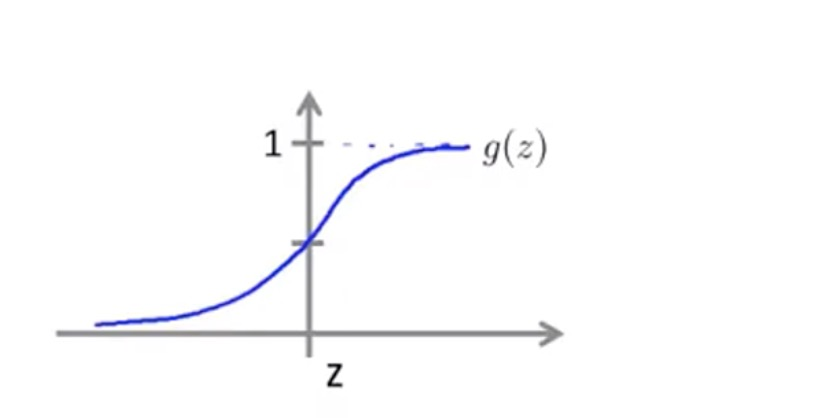
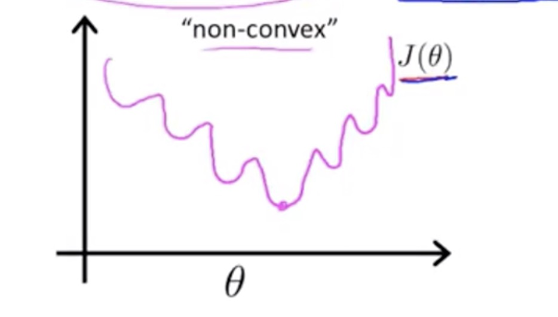
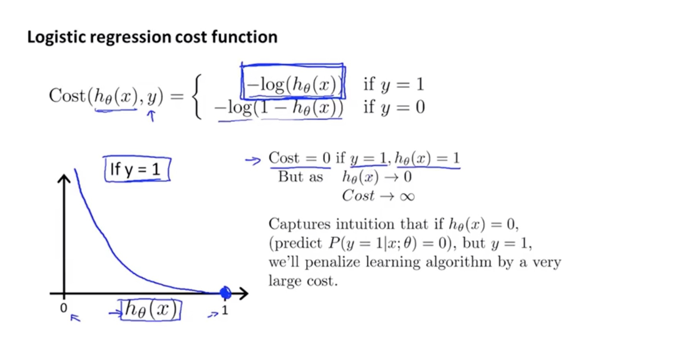

## 分类
不推荐对分类问题采用线性回归来解决
逻辑回归不是用来解决回归问题的，而是用来解决离散问题的

0 表示Negative Classs
1 表示Positive Class
> 0或1都是自定义的，但是通常负类表示没有某种东西，例如没有垃圾邮件，或者没有恶性肿瘤

通常我们先从二分类开始，也就是分类0或1，实际上有时不止两种情形，甚至分类0，1，2，3等，即多分类

首先做出一条直线拟合数据，之后给定一个阀值来确定分类的界限

## 假设陈述

> 逻辑回归中假设函数的表示方法

$$Logistic  Function(sigmoid function) 指的是 g(z) = \frac{1}{1+e^{-z}} $$

$$结合 h_Θ(x) = Θ^Tx 可以得到h_Θ(x) = \frac{1}{1+e^{-Θ^Tx}}$$

$$h_Θ(x) 将会被认为是输入x的情况下，y=1的概率，例如h_Θ(x)=0.7，也就是x为某一值的情况下，有70%可能是恶性肿瘤$$

$$h_Θ(x) = P(y=1 | x; Θ) 表示在概率参数Θ作用下， 病人特征为x的输入下，获得恶性肿瘤的概率$$

## 决策界限

> 对于二分类问题，我们使用逻辑回归函数将会计算出概率，例如判断是否为恶性肿瘤时，我们如果获得的概率 >= 0.5 我们就可以预测y=1, 反之则反

$$在二分类中，决策边界就是区分y=0()与y=1的那条线,Θ^Tx >= 0等价于y=1^Tx >= 0等价于y=1,Θ^Tx < 0等价于y=0$$

对于逻辑回归和线性回归，可以通过在公式中添加更高阶的多项式来使得模型获得更好的效果，例如在一次项的基础上添加二次项

## 代价函数
> 如何自动获得决策界限良好的逻辑回归式中的Θ值

因为我们使用了sigmoid函数来构造了一个非常复杂的公式，代价函数图变化如上图所示，此时代价函数不使用以往的梯度函数，因为代价函数并不可能得到一个全局最小值，这是一个凸优化问题

## 简化代价函数与梯度下降

## 高级优化

## 多元分类：一对多

