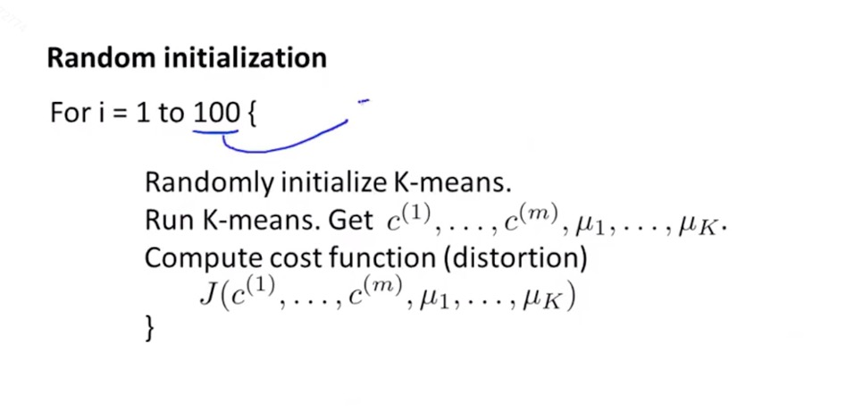
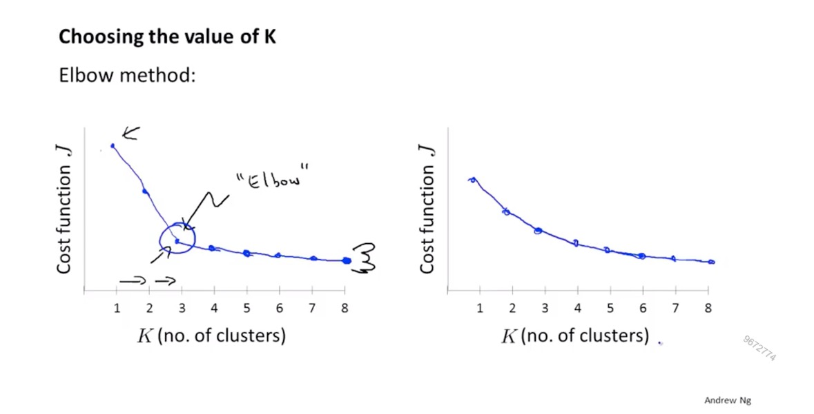

# 无监督学习

## K-means算法
> 最关键的便是簇分配和移动聚类中心

步骤：
1. 随机生成两点(将数据分成几类就随机生成几个点)，两点分别是聚类中心
2. 遍历所有样本到聚类中心的距离，为每个样本找到距离最近的聚类中心，叫做簇分配
3. 将所有聚类中心移动到对应类所有点的平均位置(每个维度都是该类点维度的平均值)
> 不断重复2,3步骤，直到不再改变

输入：
1. 分配簇的个数
2. 训练集

> 当有一个聚类中心在随机初始化后，没有分配到点，直接移除，之后重新生成

## 优化目标

> 在监督学习中，每个算法都有一个最小化代价函数也就是目标函数，实际上在K-means算法中，我们也是有一个优化目标函数的

符号说明：
$$c^{(i)} 表示当前样本x^{(i)} 所属的那个簇的索引或序号$$
$$u_k 表示 第k个聚类中心的位置$$
$$K 表示簇数量 $$
$$k 表示聚类中心的下标， 取值范围从1到K $$
$$u_c^{(i)} 表示x^{(i)}所属的那个簇的聚类中心 $$

这个代价函数有时也叫失真代价函数或K均值算法的失真

## 随机初始化

> 有时我们初始化将会使算法陷入到一个局部最优而不是全局最优，因此我们需要注意初始化，有一种方法比其他方法更值得推荐，通常这种方法效果最好

选取的聚类中心不可以 ≥ 样本数量

1. 从样本中选取k个点作为最初的k个聚类中心
2. 尝试初始化算法多次，并运行算法很多次
循环1，2足够的次数为止，**如下图所示**

多次运行聚类初始化算法对于聚类数量很小的情况下将会有很大的改进，例如2-10个聚类时

## 选取聚类数量
> 最主要的还是手工选择数量

思路1:
根据肘部法则来选择k, 例如在左边这个图中，在某一点，代价函数将会由下降很快变得很平缓，所以我们可以选择这个数量作为聚类数量，但经常我们不会得到这么明显的图像，例如图中的右半图

思路2:
结合后续的用途，例如是组织计算机集群还是市场分割来决定合适的聚类数量，例如决定是否划分为3类T恤，可以设置k=3