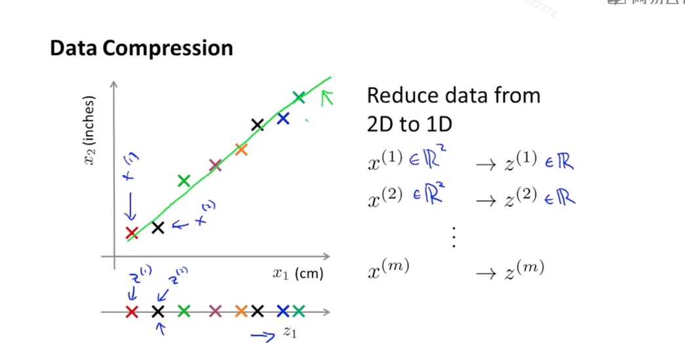

# 降维

## 目标I: 数据压缩
> 这里有另外一种无监督学习的方法，降维可以使得我们数据占用更少的空间，还可以让我们对学习算法进行加速

对于高度冗余的特征，我们可以对其进行简化，例如两个特征：厘米长度和英尺长度

例如将二维样本数据投影到一条直线上，变成1维数据

例如在3维空间中，我们发现立体数据集都在一个平面上，此时便可将平面单独拉出来形成一个二维坐标系表示每个独立的点

## 目标II: 可视化
> 降维不仅可以帮助我们节省数据存储空间，对于数据可视化也有很大的用处

例如对于数据我们找到特征之间的总体规律就可以将其降解为2维，并在平面上画出以帮助我们实现数据可视化

## 主成分分析问题规划1
PCA要做的是数据降维之后，把数据投影到降维的空间上，使得原来的点到投影点的距离(有时也叫投影误差)和最小

在应用PCA之前应先进行均值归一化和特征规范化

例如在二维平面降解到一维的时候，就是找到一个方向向量使得所有点投影到该直线的距离和最小(也就是最小化投影误差的方向) 在n维降解到k维的时候，也就是找到k个维度的方向向量，使得投影距离平方和最小

优化目标：最小化投影误差的平方

## 主成分分析问题规划2
给定一组数据，我们要将其执行均值标准化和特征缩放 

> 均值标准化：计算出每个特征的均值，然后用每个特征值减去对应的均值

计算协方差：
svd 代表奇异值分解

## 主成分数量选择

## 压缩重现
> 如何将PCA算法降解维度之后的特征恢复到最初的特征

## 应用PCA的建议

