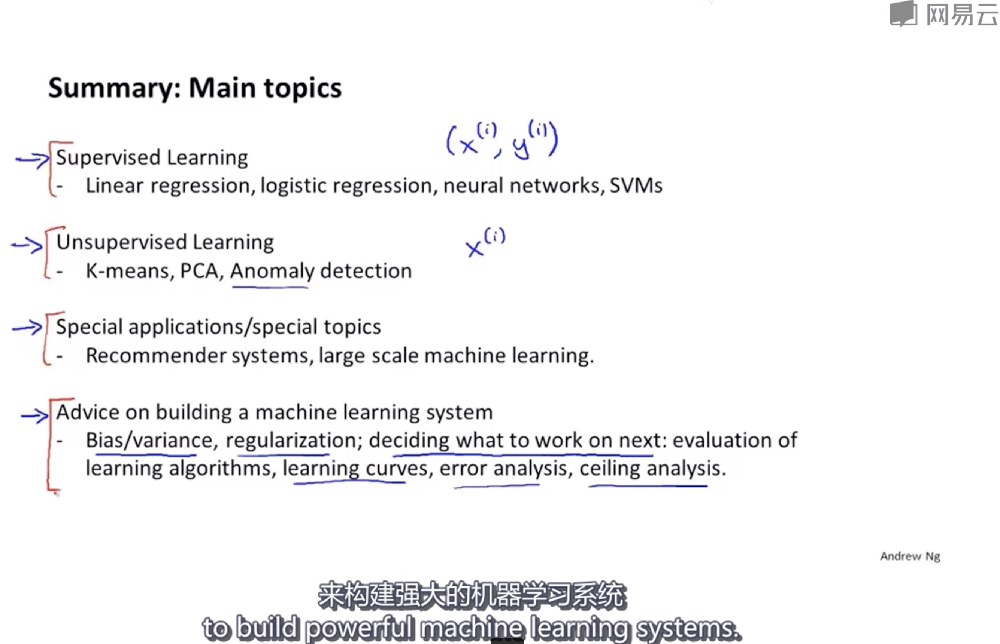

# 总结与感谢

**回顾我们学到的知识，目标：如何有效运用讲到的知识构建大规模机器学习系统**

## 监督学习(数据集中包括带标签的样本)
- 线性回归 Linear Regression
- 逻辑回归 (分类) Logistic Regression
- 神经网络 Neural Network
- 支持向量机 SVMs

## 非监督学习
- K-means K均值聚类算法(进行降维)
- PCA 主成分分析法(进行降维)
- Anomaly detection 异常检测算法（用于只有无标签的数据时，也可以用于有一部分带标签的数据来对算法进行评估）

## 特定应用和话题
- Recommender systems 推荐系统
- large scale machine learning 大规模机器学习系统(包括并行和映射-化简算法)
- 滑动窗口(sliding windows)分类器(解决计算机视觉问题， 例如Photo OCR)

## 如何构建机器学习系统的建议
- 尝试是什么东西使机器学习算法工作或不工作，因此讨论了方差(variance)和偏差(bias)
- 如何使用正则化(regulation)解决一些方差问题
- 讨论如何决定下一步该做什么(即在开发机器学习系统时如何合理分配时间)
- 学习算法的评价方法(evaluation of learning algorithms), 介绍了诸如召回率(precision recall)和F1分数类似的评价指标 以及 实践检测方法(比如训练集，交叉验证集，测试集)
- 如何调试算法来确保算法正常工作，因此讲了一些诊断方法，比如学习曲线(learning curves)，还有误差分析(errir analysis)，上限分析(ceiling analysis)等内容, 所有这些都可以确定下一步做什么
