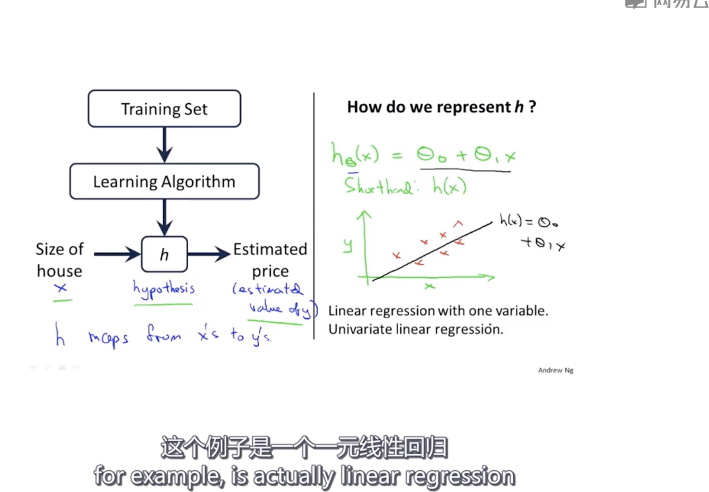
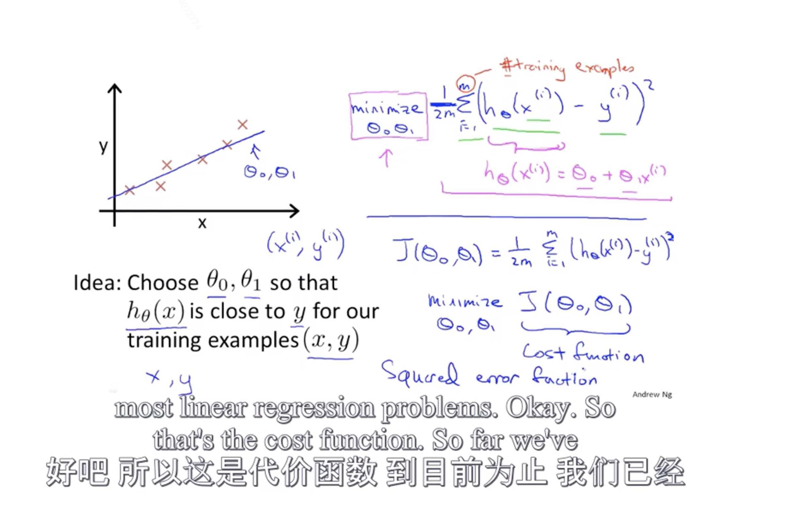
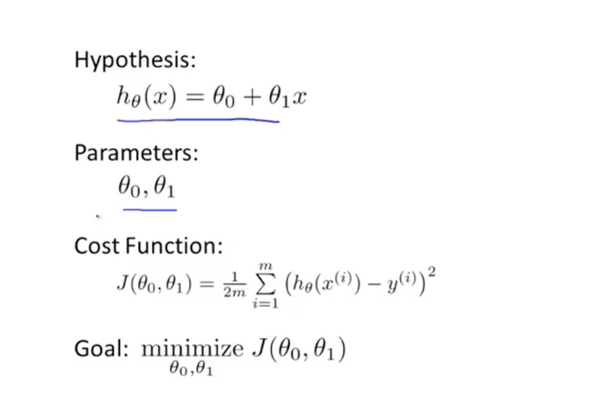

# 单变量线性回归

## 模型描述

### 课程用到的一些符号说明
- m = 训练集的样本数量
- x = 输入变量 （或特征）
- y = 输出变量 (预测的值)
- (x , y) 表示一个训练样本
- $$(x_i, y_i)$$ 表示第i个训练样本

> 一般可以表示为$$h(x) = c_1 * x + c_2$$

## 代价函数

在线性回归预测中，我们希望获得两个理想的参数$$c_1和c_2$$使得我们预测的结果h与实际的结果y的差值越小越好。这里我们引入了代价函数$$\sum_{i=1}^m{(h-y)^2} $$， 也就是**预测值与实际值的误差平方和越小越好**, 也就是**最小化代价函数**

> 代价函数也被成为平方误差函数或平方误差代价函数

此时我们已经将问题转换为求使得代价函数$$\sum_{i=1}^m{(h-y)^2} $$最小的两个理想参数$$c_1和c_2$$， 我们可以把其看作线性回归的整体目标函数。

为了更直观理解，吴恩达老师将其代价函数简化为如下图中描述(即在求和的基础上除以2m)

也有其他评估线性回归的代价函数，但是平方误差和是我们最常见的一个评估手段。

